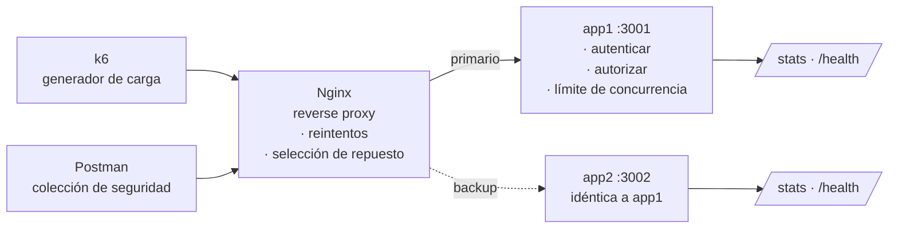

# TFU Unidad 2 — Tácticas de Arquitectura
## Plan de implementación y documentación de la demostración

**Grupo 5 — Caso AeroSur**
**Tácticas demostradas:** reintentos + repuesto redundante (disponibilidad) · autenticar actores + autorizar actores (seguridad, categoría *resistir*)

---

## 1. Objetivo de la demostración

Mostrar en cinco minutos, con evidencia observable en vivo, que las cuatro tácticas seleccionadas satisfacen los criterios de ajuste de **RNF-DIS-01** y **RNF-SEG-01** sobre el caso de uso **PUC-01 – Transportar equipaje**.

La demo **no** pretende ser un sistema de ruteo de equipaje real. Es un banco de pruebas mínimo cuyo único propósito es hacer visible el comportamiento de cada táctica ante el estímulo que la justifica.

**Decisión rectora:** la saturación del servidor primario se provoca de forma **determinista**, no por agotamiento real de recursos de hardware. Una demo que depende de la carga que aguante el notebook del expositor es una demo que puede fallar frente al tribunal.

---

## 2. Trazabilidad: táctica → mecanismo → evidencia

Esta es la tabla que hay que tener a mano al exponer. Cada fila conecta la teoría con algo que el tribunal va a ver en pantalla.

| Táctica (catálogo ANDIS) | Categoría | Mecanismo en la demo | Evidencia visible | Criterio de ajuste que prueba |
|---|---|---|---|---|
| Reintentos | Disponibilidad → recuperarse de fallas | `proxy_next_upstream` en Nginx, 3 intentos | Header `X-Estados: 503, 200` | RNF-DIS-01 · CA-2 (3 reintentos) |
| Repuesto redundante (*warm*) | Disponibilidad → recuperarse de fallas | `server app2 backup` en el *upstream* | Header `X-Instancias-Probadas` con dos IPs + contador de `/stats` de app2 despegando | RNF-DIS-01 · CA-1 (< 2 s) |
| Autenticar actores | Seguridad → resistir | Login con usuario/contraseña que emite JWT firmado | `POST /auth/login` → 200 con token; petición sin token → 401 | RNF-SEG-01 |
| Autorizar actores | Seguridad → resistir | *Middleware* que compara el *claim* `rol` contra los roles permitidos del endpoint | Mismo `PUT`, token de operador → 403; token de supervisor → 200 | RNF-SEG-01 |

**Punto fuerte para la exposición:** el mismo endpoint devuelve 403 o 200 según el token. Es la forma más limpia de mostrar que autenticación y autorización son dos cosas distintas, que es exactamente lo que separa a las dos tácticas elegidas.

---

## 3. Arquitectura de la demostración



**Por qué Nginx y no lógica en la aplicación:** las tácticas de recuperación ante fallas se aplican en el elemento que *detecta* la falla, no en el que la sufre. Poner el reintento en el proxy demuestra la separación de responsabilidades y evita que el cliente tenga que saber que existe un repuesto. Si el tribunal pregunta por qué no un *service mesh* o un balanceador en la nube: es la misma decisión de diseño instanciada con la tecnología más simple que la soporta.

**Estilo de arquitectura:** basado en servicios, con dos instancias replicadas de un único servicio detrás de un intermediario. No es microservicios y conviene decirlo explícitamente: no hay un impulsor que exija descomposición funcional, solo redundancia.

---

## 4. Plan de construcción

### Estructura del repositorio

```
demo-tfu/
├── docker-compose.yml        # nginx + app1 + app2; perfiles opcionales: carga, verificacion, observabilidad
├── iniciar.sh                # levanta y espera
├── verificar.sh              # chequeo con curl + jq
├── COMANDOS.md               # los mismos chequeos como comandos sueltos
├── presentacion.md           # guion: contexto, requerimientos, qué decir
├── nginx/
│   └── nginx.conf
├── servicio/
│   ├── Dockerfile
│   ├── package.json
│   └── src/
│       ├── index.js          # servidor, rutas, /stats y /metrics
│       ├── auth.js           # autenticar + autorizar
│       └── bulkhead.js       # límite de concurrencia (saturación controlada)
├── carga/
│   └── escenario.js          # script de k6 (hace el login solo; umbrales = criterios)
├── postman/
│   ├── AeroSur-TFU.postman_collection.json   # salud + seguridad + disponibilidad
│   └── generar_coleccion.py                  # genera el JSON
└── observabilidad/           # Prometheus + tablero de Grafana (perfil opcional)
```

### Fase 1 — Servicio de ruteo con las tácticas de seguridad

Dos usuarios en memoria (no hace falta base de datos para la demo; documentarlo como simplificación explícita).

```js
// auth.js — táctica: autenticar actores
const USUARIOS = {
  operador:   { pass: '1234', rol: 'operador'   },
  supervisor: { pass: '1234', rol: 'supervisor' },
};

function login(req, res) {
  const { usuario, password } = req.body;
  const u = USUARIOS[usuario];
  if (!u || u.pass !== password) {
    return res.status(401).json({ error: 'credenciales inválidas' });
  }
  const token = jwt.sign({ usuario, rol: u.rol }, SECRETO, { expiresIn: '1h' });
  res.json({ token, rol: u.rol });
}

// táctica: autenticar actores (verificación en cada pedido)
function autenticar(req, res, next) {
  const header = req.headers.authorization || '';
  const token = header.startsWith('Bearer ') ? header.slice(7) : null;
  if (!token) return res.status(401).json({ error: 'falta token' });
  try {
    req.actor = jwt.verify(token, SECRETO);
    next();
  } catch {
    res.status(401).json({ error: 'token inválido' });
  }
}

// táctica: autorizar actores
function autorizar(...rolesPermitidos) {
  return (req, res, next) => {
    if (!rolesPermitidos.includes(req.actor.rol)) {
      return res.status(403).json({
        error: 'rol sin permiso para esta operación',
        rolDelActor: req.actor.rol,
        rolesRequeridos: rolesPermitidos,
      });
    }
    next();
  };
}
```

Rutas:

| Método | Ruta | Protección | Propósito en la demo |
|---|---|---|---|
| `POST` | `/auth/login` | pública | Obtener token |
| `GET` | `/api/equipaje/:id/scan` | autenticar | Ruta de carga (la que satura k6) |
| `PUT` | `/api/equipaje/:id/ruta` | autenticar + autorizar(`supervisor`) | Mostrar 403 vs 200 |
| `GET` | `/stats` | pública | Contador de pedidos atendidos por instancia |
| `GET` | `/health` | pública | Estado de la instancia |

> Para no tener que loguearse durante el pico de carga, `/api/equipaje/:id/scan` puede aceptar un token pre-generado de larga duración cargado como variable de entorno en el script de k6. Dejarlo documentado como conveniencia de la demo.

### Fase 2 — Saturación determinista (*bulkhead*)

Este es el corazón de la demo. En vez de esperar que app1 se caiga por agotamiento real, se le impone un límite explícito de trabajo concurrente.

```js
// bulkhead.js
const MAX_CONCURRENTES = Number(process.env.MAX_CONCURRENTES || 5);
let enVuelo = 0;
let atendidos = 0, rechazados = 0;

function bulkhead(req, res, next) {
  if (enVuelo >= MAX_CONCURRENTES) {
    rechazados++;
    return res.status(503).json({
      instancia: process.env.INSTANCIA,
      error: 'servicio saturado',
    });
  }
  enVuelo++;
  atendidos++;
  res.on('finish', () => { enVuelo--; });
  next();
}
```

Con una latencia simulada de 300 ms por lectura de etiqueta y `MAX_CONCURRENTES = 5`, la capacidad teórica de app1 es de unos **16 pedidos/segundo**. Cualquier carga por encima de eso produce 503 de forma inmediata y reproducible en cualquier máquina.

**Cómo justificarlo si preguntan:** el límite de concurrencia es en sí mismo una táctica de rendimiento (*limitar el tamaño de las colas* / patrón *Bulkhead*). Acá se usa como instrumento para producir el estímulo del escenario de disponibilidad de manera controlada. Vale la pena decirlo antes de que lo pregunten: muestra que se entiende la diferencia entre la táctica que se demuestra y el andamiaje que la hace demostrable.

Dar a app2 un `MAX_CONCURRENTES` **mayor que el pico de carga** para que absorba el desvío sin
saturarse también. El valor no es libre: k6 mantiene un pedido en vuelo por usuario virtual, así
que el pico de 60 VUs son 60 pedidos concurrentes y el límite del repuesto tiene que quedar por
encima. Se fija en **100**.

> **Verificado en banco.** Con `MAX_CONCURRENTES = 50` en app2 la demo falla: el repuesto satura
> junto con el primario y el cliente ve el 97 % de los pedidos con error. Con 100, la misma corrida
> da 0 % de error y un p(95) de 306 ms. Si se cambia el pico del escenario de k6, hay que mover
> este número con él.

### Fase 3 — Nginx: reintentos y repuesto redundante

```nginx
upstream ruteo_equipaje {
    server app1:3000 max_fails=2 fail_timeout=10s;
    server app2:3000 backup max_fails=0;  # repuesto redundante (warm)
}

server {
    listen 80;

    location / {
        proxy_pass http://ruteo_equipaje;

        # táctica: reintentos
        proxy_next_upstream       error timeout http_503;
        proxy_next_upstream_tries 3;
        proxy_connect_timeout     1s;

        # evidencia observable
        add_header X-Instancias-Probadas $upstream_addr     always;
        add_header X-Estados             $upstream_status   always;
        add_header X-Tiempo-Total        $upstream_header_time   always;
    }
}
```

El `max_fails=0` del repuesto no es decorativo. Sin él, `backup` hereda el valor por defecto
`max_fails=1`: basta un único 503 de app2 para que Nginx la saque de rotación durante
`fail_timeout` y, con el primario ya marcado como caído, no quede ningún servidor disponible.
El proxy pasa entonces a devolver error de inmediato a todo el tráfico, que es exactamente el
escenario que la táctica debería evitar. Es el modo de falla más traicionero de esta
configuración, porque solo aparece bajo carga sostenida.

En la configuración real hay además `zone` + `resolver 127.0.0.11` + `resolve` en cada `server`:
Nginx vuelve a resolver `app1` y `app2` cada 2 s. Sin eso, la resolución ocurre una sola vez al
arrancar, y si se reinicia una instancia y cambia (o se intercambia) la IP, el proxy sigue
mandando el tráfico "de app1" a la IP vieja: la demo deja de conmutar sin ningún error
visible. Verificado en banco: pasó al reiniciar app1 y app2 sin reiniciar nginx.

`$upstream_header_time` y no `$upstream_response_time`: `add_header` se evalúa en el momento en
que Nginx manda los headers al cliente, cuando la respuesta del upstream todavía no terminó de
llegar. Con `$upstream_response_time` el header sale con un guion en vez de un número y la
evidencia de tiempo se pierde justo en el pedido que hay que mostrar. Verificado en banco.

Los tres `add_header` son el artefacto de evidencia más valioso de toda la demo. Cuando app1 se satura, una única respuesta muestra:

```
X-Instancias-Probadas: 172.18.0.2:3000, 172.18.0.3:3000
X-Estados:             503, 200
X-Tiempo-Total:        0.002, 0.311
```

Ahí está el reintento **y** el failover al repuesto, en dos líneas, con el tiempo que tardó la conmutación.

### Fase 4 — Generación de carga con k6

```js
import http from 'k6/http';
import { check } from 'k6';

const TOKEN = __ENV.TOKEN;

export const options = {
  stages: [
    { duration: '15s', target: 5  },   // operación normal: un vuelo
    { duration: '30s', target: 60 },   // pico: tres vuelos simultáneos
    { duration: '15s', target: 5  },   // vuelve la normalidad
  ],
};

export default function () {
  const r = http.get('http://localhost:8080/api/equipaje/123/scan', {
    headers: { Authorization: `Bearer ${TOKEN}` },
  });
  check(r, { 'equipaje ruteado': (x) => x.status === 200 });
}
```

Ejecución con el panel web integrado (k6 ≥ 0.49, no requiere Prometheus ni Grafana). El
escenario hace el login solo, no hay que pasarle un token:

```bash
K6_WEB_DASHBOARD=true k6 run carga/escenario.js
# panel en http://localhost:5665
```

O sin instalar k6, dentro de Docker (perfil `carga`):

```bash
docker compose --profile carga run --rm --service-ports k6
```

**Sobre Grafana:** la demo **no depende** de él. El panel integrado de k6 muestra tasa de pedidos, latencia p95 y tasa de error, que es todo lo que hace falta para el cierre. Existe un perfil opcional `observabilidad` (Prometheus + Grafana, tablero provisionado que abre solo, ver README §5) para mostrar *visualmente* cómo el tráfico pasa de app1 a app2. Usarlo únicamente si se ensayó con él: son dos contenedores más y un modo de falla nuevo justo antes de exponer. Si el día de la exposición no levanta, se sigue sin él y no se pierde nada.

### Fase 5 — Colección de Postman para seguridad

Postman es el instrumento correcto para las tácticas de seguridad: cada pedido es un acto discreto y el resultado es legible de un vistazo. La colección `postman/AeroSur-TFU.postman_collection.json` tiene además una carpeta de disponibilidad que dispara el pico de 20 pedidos en paralelo desde un pre-request (`pm.sendRequest`) y comprueba los headers de evidencia: es la verificación completa sin scripts de shell, y corre igual con `newman` dentro de Docker (perfil `verificacion`).

| # | Pedido | Resultado esperado | Táctica que evidencia |
|---|---|---|---|
| 1 | `PUT /api/equipaje/123/ruta` sin token | `401 falta token` | Autenticar actores |
| 2 | `POST /auth/login` con `operador/1234` | `200` + token | Autenticar actores |
| 3 | `PUT /api/equipaje/123/ruta` con token de operador | `403 rol sin permiso` | Autorizar actores |
| 4 | `POST /auth/login` con `supervisor/1234` | `200` + token | — |
| 5 | `PUT /api/equipaje/123/ruta` con token de supervisor | `200 ruta modificada` | Autorizar actores |

Guardar el token en una variable de colección con un script de test para no copiar y pegar en vivo:

```js
pm.collectionVariables.set('token', pm.response.json().token);
```

---

## 5. Decisiones de arquitectura registradas

### ADR-001 — Ubicar reintentos y selección de repuesto en el proxy inverso

**Estado:** aceptada

**Contexto.** RNF-DIS-01 exige reintentar ante fallas transitorias y conmutar a una instancia secundaria. La lógica puede vivir en el cliente, en la aplicación o en un intermediario. El cliente son escáneres de etiquetas con capacidad de cómputo limitada y firmware difícil de actualizar.

**Decisión.** Vamos a implementar ambas tácticas en un proxy inverso Nginx ubicado entre los escáneres y las instancias de procesamiento.

**Consecuencias.** Los escáneres quedan agnósticos a la topología de servidores y se puede agregar o quitar réplicas sin tocar el firmware. El proxy se convierte en punto único de falla, lo que en producción exigiría replicarlo también (con IP virtual o *keepalived*); en la demostración se asume disponible. La lógica de reintento queda en configuración declarativa en vez de código, lo que la hace auditable pero menos flexible ante políticas de reintento complejas como retroceso exponencial.

### ADR-002 — Provocar la saturación con un límite de concurrencia explícito

**Estado:** aceptada

**Contexto.** Demostrar el failover requiere que el primario falle en un momento predecible. Agotar recursos reales depende del hardware del expositor y no es reproducible.

**Decisión.** Vamos a imponer en cada instancia un límite de pedidos concurrentes configurable por variable de entorno, que devuelve 503 al superarse.

**Consecuencias.** La demostración es reproducible en cualquier máquina y el momento de la conmutación es controlable. A cambio, la falla es simulada y no representa el modo de falla real de un servidor saturado, que degrada gradualmente en vez de rechazar de forma limpia. Esta limitación debe declararse durante la exposición.

### ADR-003 — Repuesto en modo *warm* en vez de *hot*

**Estado:** aceptada

**Contexto.** El catálogo de tácticas ofrece repuesto frío, tibio y caliente. El costo operativo crece con la temperatura.

**Decisión.** Vamos a mantener app2 encendida y con estado inicializado, pero sin recibir tráfico mientras el primario responda (`backup` en el *upstream*).

**Consecuencias.** El tiempo de conmutación queda por debajo del criterio de 2 segundos porque no hay que arrancar un proceso. El costo del contenedor ocioso es el conflicto que ya está declarado en RNF-DIS-01. Un repuesto caliente (ambas instancias recibiendo tráfico) daría mejor aprovechamiento pero haría invisible el failover en la demo, que es justamente lo que hay que mostrar.

---

## 6. Guion de la exposición (5 minutos)

Preparar **tres ventanas** dispuestas antes de empezar: Postman, terminal dividida (k6 a la izquierda, `watch` de `/stats` a la derecha), y navegador en el panel de k6.

| Tiempo | Acción | Qué se dice |
|---|---|---|
| 0:00–0:45 | Diagrama en pantalla | Presentar las cuatro tácticas y en qué elemento vive cada una |
| 0:45–1:45 | Postman, pedidos 1 a 5 | "Sin token, 401: autenticar. Con token de operador, 403: autorizar. Mismo endpoint, mismo sistema, distinta identidad." |
| 1:45–2:15 | Carga base, mostrar headers | "En operación normal, `X-Instancias-Probadas` tiene una sola IP. Todo lo atiende el primario." |
| 2:15–3:45 | Arrancar el pico de k6 | Señalar los 503 en el panel, los dos valores en `X-Estados`, y el contador de app2 despegando en `/stats` |
| 3:45–4:30 | Baja la carga | "Vencido el `fail_timeout`, el tráfico vuelve solo al primario. No hay intervención manual." |
| 4:30–5:00 | Cierre sobre los criterios de ajuste | Leer CA-1 y CA-2 y señalar el número medido en pantalla |

**El cierre es lo que decide la nota.** No cerrar con "esto funciona", sino con la comparación explícita:

- CA-2 pide *tres reintentos antes de notificar error*. En pantalla: `proxy_next_upstream_tries 3`.
- CA-1 pide *conmutar en menos de 2 segundos*. En pantalla: el p95 del panel de k6 durante el pico, y `X-Tiempo-Total`, que suele dar orden de milisegundos.

Que los números de la demo apunten a los números del documento de la Parte 1 es lo que distingue una demostración de una exhibición de herramientas.

---

## 7. Riesgos y planes de contingencia

| Riesgo | Probabilidad | Mitigación |
|---|---|---|
| Falla la red o Docker Hub el día de la exposición | Media | Construir las imágenes con anticipación y verificar que levantan sin red (`docker compose up` con imágenes ya en caché local) |
| El panel web de k6 no abre (versión < 0.49) | Media | Verificar con `k6 version` durante los ensayos. Alternativa: el resumen de texto de k6 al final de la corrida ya muestra p95 y tasa de error |
| Nginx no conmuta porque el 503 no está en `proxy_next_upstream` | Baja | Está incluido explícitamente en la configuración. Verificar en el ensayo, es el error más común |
| La demo se pasa de 5 minutos | **Alta** | Ensayar cronometrado al menos dos veces completas. Si hay que recortar, el tramo 3:45–4:30 (recuperación del primario) es el prescindible |
| Preguntan por qué no hay *circuit breaker* | Media | Respuesta preparada: es el patrón que complementa a estas tácticas cuando la falla deja de ser transitoria; queda fuera del alcance porque las combinaciones estaban dadas por la consigna |

**Plan B absoluto:** grabar un video de la demo funcionando la noche anterior. Si algo falla en vivo, se muestra la grabación y se explica sobre ella. Cuesta veinte minutos y elimina el peor escenario posible.

---

## 8. Checklist previo a la exposición

- [ ] `./iniciar.sh` levanta los tres contenedores sin errores
- [ ] `docker compose --profile verificacion run --rm newman` termina con 0 aserciones fallidas
- [ ] Los cinco pedidos de Postman devuelven los códigos esperados
- [ ] El token se guarda solo en la variable de colección
- [ ] `curl -i localhost:8080/api/equipaje/1/scan` muestra los tres headers `X-`
- [ ] Con carga alta, `X-Estados` muestra dos valores
- [ ] El contador de `/stats` de app2 queda en cero hasta que empieza el pico
- [ ] `k6 version` ≥ 0.49 y el panel abre en `localhost:5665`
- [ ] Ensayo completo cronometrado bajo 5:00, dos veces
- [ ] Video de respaldo grabado
- [ ] Ventanas dispuestas y zoom de la terminal aumentado para que se lea desde el fondo del aula

---

## 9. Reparto sugerido de tareas

| Responsable | Entregable |
|---|---|
| Persona 1 | Servicio Node: rutas, autenticación, autorización, `/stats` |
| Persona 2 | `bulkhead.js`, Dockerfile y `docker-compose.yml` |
| Persona 3 | `nginx.conf` y verificación de los headers de evidencia |
| Persona 4 | Script de k6, colección de Postman y video de respaldo |
| Todos | Ensayo cronometrado y guion de la exposición |

---

## 10. Ajuste recomendado al documento de la Parte 1

Una observación sobre la especificación entregada, por si el docente la señala.

**RNF-DIS-01** y **RNF-SEG-01** tienen dos capacidades unidas por una conjunción en la descripción. La regla de atomicidad de la plantilla Volere pide un hecho por requerimiento: si aparece un "y" que une dos capacidades, corresponde partirlo. Además, ambos requerimientos tienen dos criterios de ajuste numerados, que es la señal más clara de que en realidad son dos requerimientos.

La partición sugerida, conservando el contenido ya escrito:

| ID | Descripción | Criterio de ajuste |
|---|---|---|
| RNF-DIS-01 | El sistema deberá reintentar automáticamente la lectura de la etiqueta de equipaje ante fallas transitorias de red. | Ante la pérdida de red transitoria de un escáner, el sistema reintenta la conexión 3 veces antes de notificar un error. |
| RNF-DIS-02 | El sistema deberá redirigir el procesamiento del ruteo de equipaje a una instancia secundaria ante la indisponibilidad de la instancia principal. | Al simular la caída del servidor principal, el procesamiento se redirige a la réplica en menos de 2 segundos. |
| RNF-SEG-01 | El sistema deberá autenticar a todo actor antes de permitirle interactuar con el ruteo de equipaje. | Todo pedido sin credencial válida se rechaza con código 401. |
| RNF-SEG-02 | El sistema deberá autorizar cada operación sobre el ruteo de equipaje según el rol del actor autenticado. | Un actor con rol operador que intente modificar una ruta recibe un rechazo con código 403. |

La ventaja secundaria es que la partición deja **un requerimiento por táctica**, lo que hace que la tabla de trazabilidad de la sección 2 sea uno a uno y la exposición mucho más fácil de seguir.

Un detalle menor de nomenclatura: en el catálogo ANDIS, *replicación* aparece bajo la táctica de **voto**, dentro de *detectar fallas*. Lo que están aplicando para recuperarse es **repuesto redundante**. El documento ya usa el nombre correcto en el encabezado, pero la descripción de RNF-DIS-01 dice "mediante replicación". Conviene unificar a "repuesto redundante" para que el nombre de la táctica coincida con el del catálogo.
